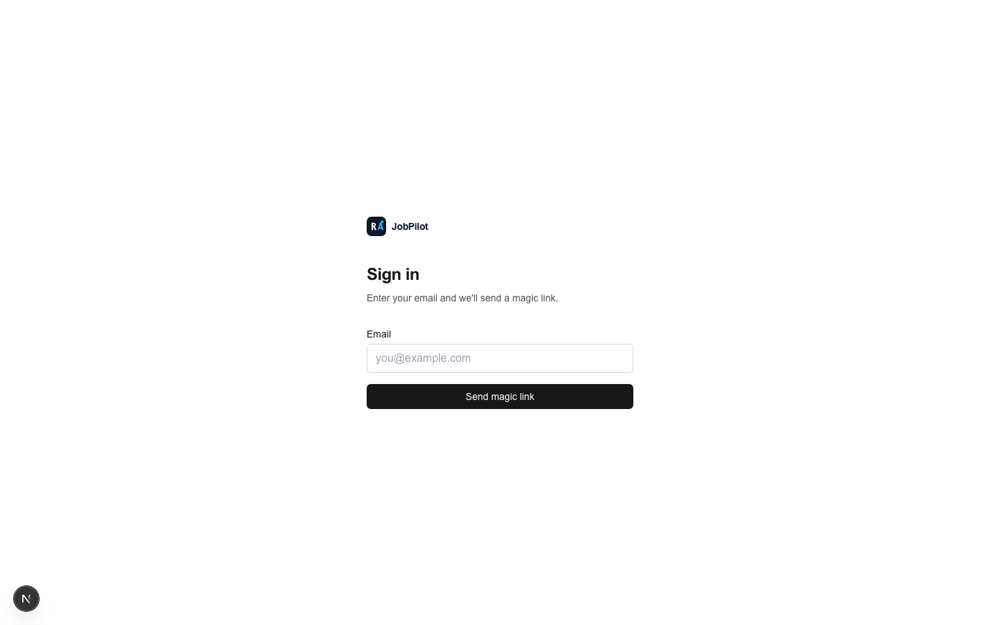
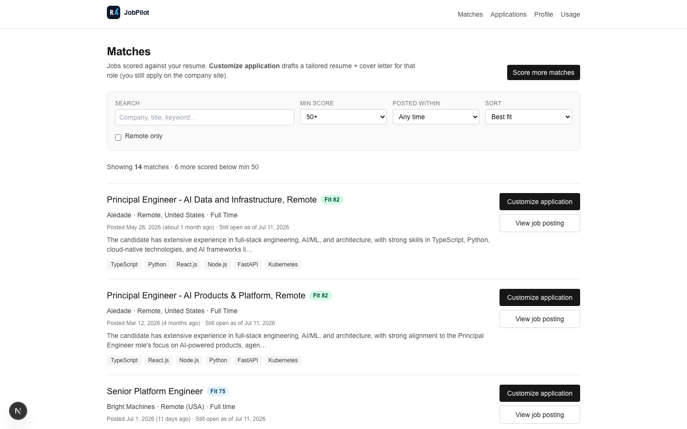
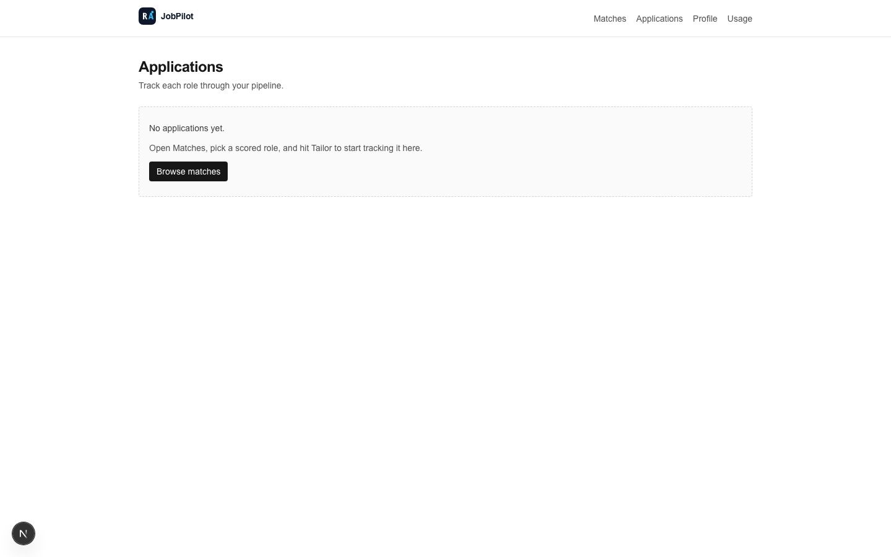
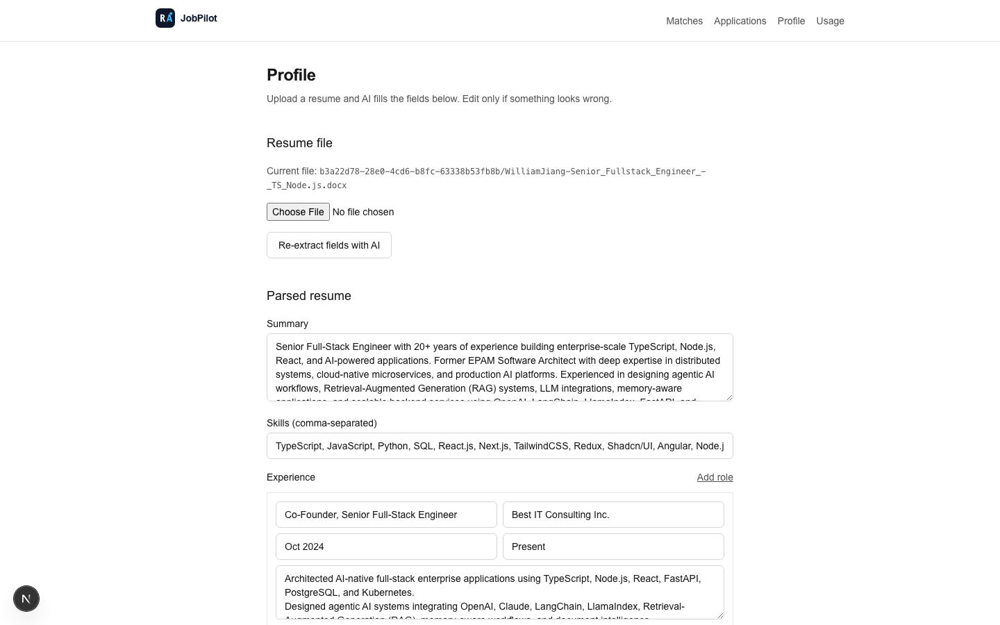
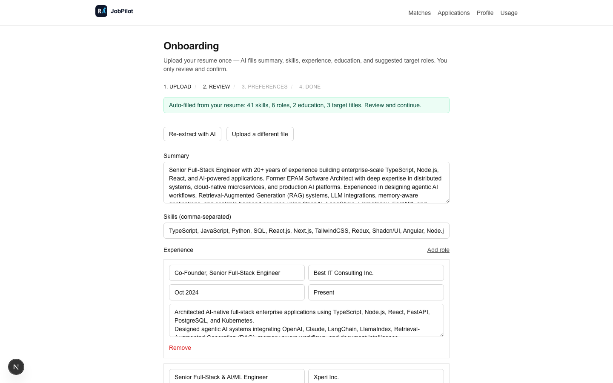
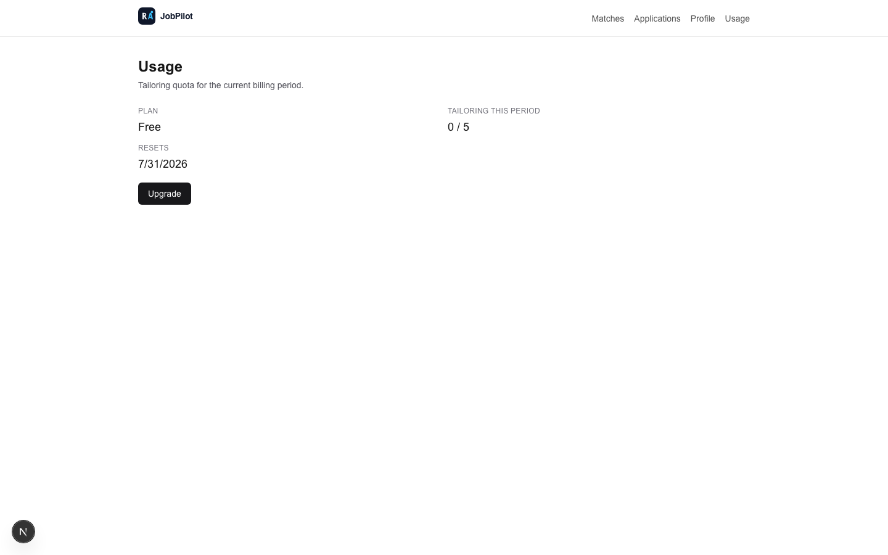

# JobPilot

JobPilot is an AI career-operations pipeline: upload a resume, get fields auto-filled by LLM, score Greenhouse/Lever jobs against your profile, tailor applications with human review, track them on a Kanban board, and receive a weekly digest. Stripe and email run in **mock** mode by default.

## What’s implemented

- Magic-link auth (Supabase)
- Resume upload → **AI autofill** (summary, skills, experience, education, suggested preferences) + re-extract
- ATS ingestion: Greenhouse + Lever (`/api/cron/poll-ats`)
- Scoring: cron batch **or** Matches → **Score matches now** (`/api/score/run`)
- Tailoring + regenerate + review UI; Kanban tracker
- Quota / mock Stripe portal; weekly digest (mock email)
- Brand: SVG favicon + logo in nav / login / home

## Docs map

| Doc | Purpose |
|---|---|
| [`docs/03-jobpilot-workflow.md`](docs/03-jobpilot-workflow.md) | **Start here** — runtime workflows + sequence diagrams |
| [`docs/01-jobpilot-product-spec.md`](docs/01-jobpilot-product-spec.md) | Original product/technical spec |
| [`docs/02-jobpilot-mvp-plan.md`](docs/02-jobpilot-mvp-plan.md) | Original MVP sequencing / MoSCoW |
| [`docs/superpowers/specs/2026-07-11-jobpilot-design.md`](docs/superpowers/specs/2026-07-11-jobpilot-design.md) | Brainstorming design decisions |
| [`docs/superpowers/plans/2026-07-11-jobpilot-mvp.md`](docs/superpowers/plans/2026-07-11-jobpilot-mvp.md) | Implementation task plan |
| [`docs/cascading-github-pipeline-playbook.md`](docs/cascading-github-pipeline-playbook.md) | Research notes that led to JobPilot |

## Setup

**Requirements:** Node.js 20+ (recommended).

1. Copy env template and fill values:

```bash
cp .env.example .env.local
```

| Variable | Source |
|---|---|
| `NEXT_PUBLIC_SUPABASE_URL` | Supabase project → Settings → API |
| `NEXT_PUBLIC_SUPABASE_ANON_KEY` | same (legacy anon JWT works with current clients) |
| `SUPABASE_SERVICE_ROLE_KEY` | same (server-only; never expose to the browser) |
| `OPENAI_COMPATIBLE_BASE_URL` | e.g. `https://api.deepseek.com` |
| `OPENAI_COMPATIBLE_API_KEY` | provider API key |
| `OPENAI_COMPATIBLE_MODEL` | prefer a chat model that returns `content` (e.g. `deepseek-chat`) |
| `CRON_SECRET` | long random string; required for cron routes |
| `BILLING_MODE` | `mock` (default) or `live` |
| `EMAIL_MODE` | `mock` (default) or `live` |
| `STRIPE_*` / `RESEND_*` | only when the matching mode is `live` |

2. Install and apply schema:

```bash
npm install
npx supabase db push
```

If the linked project already has migration `20260711000000_init`, push may report nothing new.

3. Seed ATS companies (recommended):

```bash
npx supabase db query --linked --file supabase/seed_companies.sql
```

4. Run the app:

```bash
npm run dev
```

Open [http://localhost:3000](http://localhost:3000). Sign in with a magic link.

## First-run pipeline

```bash
# Load secret from .env.local (shell does not auto-load it)
export CRON_SECRET="$(grep '^CRON_SECRET=' .env.local | cut -d= -f2-)"
export BASE=http://localhost:3000

# 1) Ingest jobs
curl -sS -X POST "$BASE/api/cron/poll-ats" \
  -H "Authorization: Bearer $CRON_SECRET"

# 2) Complete onboarding (upload resume → review autofill)

# 3) Score from Matches UI (“Score matches now”), or:
curl -sS -X POST "$BASE/api/cron/score" \
  -H "Authorization: Bearer $CRON_SECRET"
```

| Route | Role |
|---|---|
| `POST /api/cron/poll-ats` | Ingest Greenhouse + Lever postings |
| `POST /api/cron/score` | Batch-score unscored profile × posting pairs |
| `POST /api/score/run` | Score **current user** (session auth; used by Matches UI) |
| `POST /api/cron/digest` | Weekly digests (mock or Resend) |
| `POST /api/profile/resume` | Upload + LLM autofill |
| `POST /api/profile/resume/reparse` | Re-extract from stored file |

**Note:** Matches only lists rows in `scores`. After ingest you can have thousands of `postings` but an empty Matches page until scoring runs.

## Mock billing & email

- **`BILLING_MODE=mock`** — upgrade portal returns a local mock URL; no Stripe charges.
- **`EMAIL_MODE=mock`** — digests log to the server console (`{ mocked: true }`).

## Architecture

Core libraries: `src/lib/{ingestion,scoring,tailoring,applications,billing,notifications,llm,profile}`.

Brand assets: `public/favicon.svg`, `public/logo.svg`, `src/components/brand/JobPilotLogo.tsx`.

## Scripts

```bash
npm run dev    # Next.js (Turbopack)
npm test       # Vitest
npm run build  # production build
```

## Account deletion

**Profile → Danger zone** → `DELETE /api/account/delete` removes Storage objects under `resumes/{user_id}/` and deletes the auth user (FK cascade).

<!-- screenshots -->
## Screenshots

| Home | Login | Matches |
| --- | --- | --- |
|  |  |  |

| Applications | Profile | Onboarding |
| --- | --- | --- |
|  |  |  |

| Usage |
| --- |
|  |

<!-- /screenshots -->
