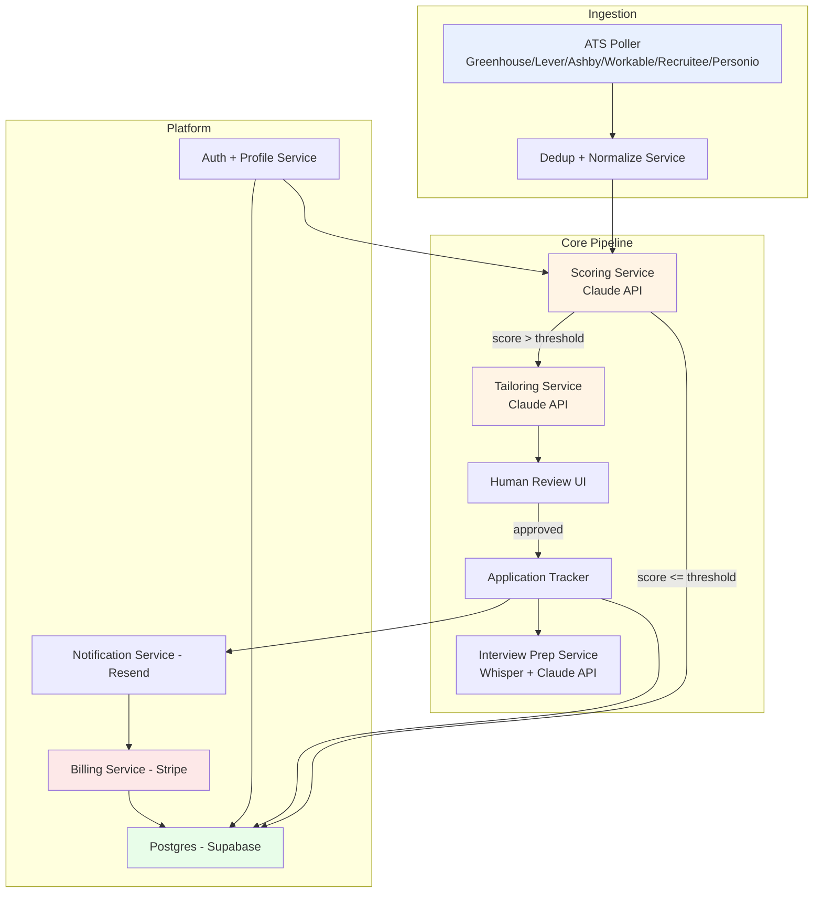
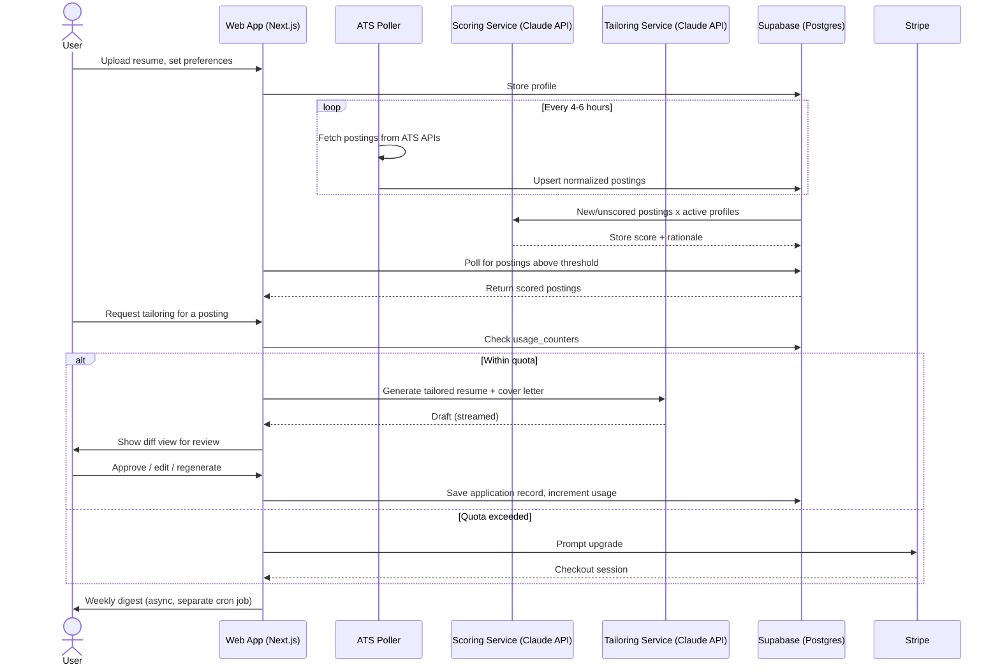

# JobPilot — Product & Technical Specification

**Version:** 0.1 (MVP)
**Status:** Draft for build
**Owner:** [you]
**Last updated:** July 11, 2026

---

## 1. Overview

JobPilot is an AI career-operations pipeline that cascades several small, independently-swappable services into one workflow: it discovers relevant job postings, scores them against a candidate's profile, drafts tailored application materials, tracks the full application lifecycle, and preps the candidate for interviews. It is built as a chain of small OSS-pattern services rather than a single monolithic "AI wrapper," so any stage can be swapped, improved, or forked without rebuilding the system.

### 1.1 Problem statement
Job searching at scale is a repetitive, emotionally taxing data-entry problem: finding relevant postings across dozens of company career pages, customizing a resume/cover letter for each one, and tracking outcomes in a spreadsheet. Existing tools solve pieces of this (resume builders, job aggregators, ATS trackers) but nobody owns the full loop end-to-end with AI doing the repetitive cognitive work.

### 1.2 Solution summary
An agentic pipeline that:
1. Pulls fresh postings from public ATS APIs (Greenhouse, Lever, Ashby, Workable, Recruitee, Personio)
2. Scores each posting against the user's resume/profile using an LLM
3. Drafts a tailored resume + cover letter for postings above a fit threshold
4. Surfaces drafts for one-click human approval/edit
5. Tracks every application through its lifecycle (applied → screen → interview → offer/reject)
6. Preps the user for interviews using role- and company-specific mock Q&A
7. Sends a weekly digest that re-engages the user and creates natural upsell moments

---

## 2. Goals and non-goals

### Goals (MVP)
- Automate discovery + scoring + first-draft tailoring for tech/knowledge-worker roles
- Keep a legally low-risk data source footprint (public ATS APIs only — see §9)
- Ship a usable product in 6–8 weeks solo, on a sub-$100/mo infra budget
- Validate willingness-to-pay before investing in aggregator-scraping infrastructure

### Non-goals (MVP)
- Auto-submitting applications without human review (legal/ethical risk, ToS risk, and lower trust — human-in-the-loop is a deliberate design choice, not a limitation to fix later)
- Full LinkedIn/Indeed/Glassdoor coverage (Tier 3 sources — deferred, see §9.3)
- Enterprise/B2B white-label (Phase 3)
- Mobile app (responsive web only for MVP)
- Non-English resume support

---

## 3. Personas

| Persona | Description | Primary need |
|---|---|---|
| **Active searcher** | Currently job hunting, applying to 10–30 roles/week | Volume + speed without losing quality per application |
| **Passive browser** | Employed, casually watching the market | Low-effort weekly digest of strong-fit roles |
| **Crunch-mode searcher** | Just laid off, needs to move fast | High-volume tailored applications in days, willing to pay a one-time premium |

MVP prioritizes the **Active searcher** — highest engagement, clearest willingness-to-pay, easiest to reach via Reddit r/jobs, r/cscareerquestions, Indie Hackers, X.

---

## 4. Core user flows

### 4.1 Onboarding
1. User signs up (email or OAuth)
2. Uploads resume (PDF/DOCX) → parsed into structured profile (skills, experience, education)
3. Sets preferences: target roles, locations, remote/hybrid/onsite, salary floor, company size/stage, industries to exclude
4. System immediately runs one scoring pass against existing cached postings to show first results ("time to value" under 2 minutes)

### 4.2 Ongoing pipeline (automatic, background)
1. Discovery workers poll ATS APIs on a schedule (see §7.1)
2. New postings scored against every active user profile
3. Postings above threshold trigger tailoring generation
4. User gets an in-app notification + digest email entry

### 4.3 Review and apply
1. User opens a tailored draft (resume diff view + cover letter)
2. Edits inline or requests regeneration with a note ("more concise," "emphasize leadership")
3. Approves → status moves to "Ready to apply," with the original application URL
4. User applies manually on the company's site (MVP does not auto-submit — see §2 non-goals) and marks it "Applied" in JobPilot, or the system can pre-fill via browser extension in Phase 2

### 4.4 Tracking
1. Kanban-style board: Discovered → Reviewing → Applied → Screening → Interview → Offer → Rejected/Archived
2. Each card carries the job posting snapshot, tailored materials, and a timeline of status changes
3. Stale applications (no update in 21 days) auto-suggest a follow-up message draft

### 4.5 Interview prep
1. User selects an "Interview" stage application
2. System generates likely questions from the job description + company context
3. User can do a voice mock interview (local Whisper-based transcription, matching the `meetily` pattern) and gets structured feedback (clarity, structure, filler words, missing detail)

### 4.6 Weekly digest
Email summarizing: new high-fit postings, applications awaiting review, stale applications needing follow-up, and a usage/quota nudge for free-tier users.

---

## 5. System architecture



### 5.1 Component responsibilities

| Component | Responsibility | MVP implementation |
|---|---|---|
| ATS Poller | Fetch postings from public ATS JSON endpoints on a schedule | Node/Python cron workers, queued via a lightweight job queue (BullMQ or Supabase Edge Functions + pg_cron) |
| Dedup + Normalize | Canonicalize company names, titles, locations; drop duplicates and expired postings | Postgres with unique constraints on `(ats_source, external_id)`; freshness TTL of 30 days |
| Scoring Service | LLM call: profile + posting → numeric fit score + rationale | Claude API, structured JSON output |
| Tailoring Service | LLM call: profile + posting + resume → tailored resume sections + cover letter | Claude API, streamed to UI |
| Human Review UI | Diff view, inline edit, regenerate, approve | Next.js client components |
| Application Tracker | State machine for application lifecycle | Postgres table + status enum |
| Interview Prep | Generate questions, transcribe mock answers, produce feedback | Local Whisper (reuses your existing ComfyUI/Pinokio-adjacent local AI environment for cost control) or hosted Whisper API for MVP simplicity |
| Auth + Profile | User accounts, resume parsing, preferences | Supabase Auth + a resume-parsing library (or Claude API with a structured extraction prompt) |
| Billing | Quota enforcement, subscription tiers | Stripe Billing + webhooks |
| Notifications | Digest emails, in-app alerts | Resend or Postmark |

---

## 6. Data model (MVP schema)

```
users
  id (uuid, pk)
  email
  created_at
  subscription_tier (enum: free, pro, crunch)
  stripe_customer_id

profiles
  id (uuid, pk)
  user_id (fk -> users)
  resume_raw_url
  resume_parsed (jsonb: skills, experience[], education[], summary)
  preferences (jsonb: roles[], locations[], remote_pref, salary_floor,
               company_stage[], excluded_industries[])
  updated_at

postings
  id (uuid, pk)
  ats_source (enum: greenhouse, lever, ashby, workable, recruitee, personio)
  external_id (text)
  company_name
  title
  location
  employment_type
  description_raw (text)
  salary_min, salary_max (nullable)
  posted_at
  first_seen_at
  last_seen_at
  is_active (bool)
  unique (ats_source, external_id)

scores
  id (uuid, pk)
  profile_id (fk -> profiles)
  posting_id (fk -> postings)
  score (numeric 0-100)
  rationale (text)
  scored_at
  unique (profile_id, posting_id)

applications
  id (uuid, pk)
  profile_id (fk -> profiles)
  posting_id (fk -> postings)
  status (enum: discovered, reviewing, applied, screening,
          interview, offer, rejected, archived)
  tailored_resume (jsonb)
  tailored_cover_letter (text)
  applied_at (nullable)
  status_history (jsonb array of {status, timestamp})
  notes (text)

interview_sessions
  id (uuid, pk)
  application_id (fk -> applications)
  transcript (text)
  questions_generated (jsonb)
  feedback (jsonb)
  created_at

usage_counters
  user_id (fk -> users)
  period_start
  tailoring_count
  reset_at
```

---

## 7. Pipeline stage specs

### 7.1 Discovery / Ingestion
- **Sources (MVP, Tier 1 only):** Greenhouse (`boards-api.greenhouse.io/v1/boards/{company}/jobs`), Lever (`api.lever.co/v0/postings/{company}`), Ashby, Workable, Recruitee, Personio public feeds
- **Company list seeding:** Start with a curated list of 500–2,000 companies known to use these ATS platforms (tech-heavy; can bootstrap from open datasets such as the MIT-licensed `job-board-aggregator` company list, filtered/verified before use). Expand list based on user preference signals (if users repeatedly search for a company not yet tracked, auto-queue it).
- **Poll frequency:** every 4–6 hours per board; stagger requests to stay well under any implicit rate limits (these are public unauthenticated endpoints, not partner APIs — be a good citizen: reasonable concurrency, backoff on errors, identify your bot via User-Agent)
- **Dedup key:** `(ats_source, external_id)`; also fuzzy-dedupe near-identical postings that appear on multiple boards for the same company
- **Freshness:** mark `is_active = false` if a posting isn't seen in 2 consecutive polls; hard-delete or archive after 30 days

### 7.2 Scoring
- **Input:** structured profile (skills, experience, preferences) + posting text
- **Output (structured JSON):** `{score: 0-100, rationale: string, matched_skills: string[], gaps: string[]}`
- **Threshold:** configurable per user, default 70. Below threshold → archived silently, visible only in an "explore all" view, not pushed to digest
- **Cost control:** batch scoring calls; cache score per (profile, posting) pair — never re-score unchanged pairs

### 7.3 Tailoring
- **Input:** profile, posting, matched_skills/gaps from scoring step, base resume
- **Output:** tailored resume section edits (not full rewrite — preserve user's original structure and only adjust emphasis/keywords/summary) + a cover letter draft
- **Guardrail:** never fabricate experience, dates, titles, or credentials not present in the source resume — the tailoring prompt must be constrained to rephrasing/reordering/emphasizing real content only
- **Quota:** counted against `usage_counters.tailoring_count`; this is the primary paywall gate

### 7.4 Human review
- Diff view: original vs. tailored resume, section by section
- One-click regenerate with a free-text instruction
- Approve → status transitions to `reviewing` → `applied` (user-confirmed)

### 7.5 Tracking
- State machine, manually advanced by user (MVP) or via email-parsing automation (Phase 2, e.g. detecting "interview scheduled" emails via Gmail integration — requires OAuth scope and separate privacy review)
- Stale-application detector: `applied_at` + 21 days with no status change → suggested follow-up draft

### 7.6 Interview prep
- Generate 8–12 likely questions from job description + company info
- Local or hosted Whisper transcribes a recorded mock answer
- Claude API scores the answer against a structured rubric (STAR method structure, specificity, conciseness) and returns feedback
- **Privacy note:** audio should be processed and discarded, not retained, unless the user explicitly opts into saving sessions

### 7.7 Notifications / digest
- Weekly cron job aggregates: new high-fit postings, drafts awaiting review, stale applications, quota usage
- Sent via Resend/Postmark; unsubscribe-compliant (CAN-SPAM)

---

## 8. API design (MVP surface)

```
POST   /api/auth/signup
POST   /api/auth/login

GET    /api/profile
PUT    /api/profile
POST   /api/profile/resume        (multipart upload -> parsed profile)

GET    /api/postings?status=scored&min_score=70
GET    /api/postings/:id

GET    /api/applications
GET    /api/applications/:id
POST   /api/applications/:id/tailor        (trigger tailoring generation)
POST   /api/applications/:id/regenerate    (with instruction text)
PATCH  /api/applications/:id               (status update, notes)

POST   /api/interview-sessions             (create, attach audio/transcript)
GET    /api/interview-sessions/:id

GET    /api/billing/portal                 (Stripe customer portal link)
POST   /api/webhooks/stripe

GET    /api/usage                          (current quota consumption)
```

---

## 9. Third-party integrations and data sourcing

### 9.1 ATS public APIs (Tier 1 — MVP data source)
| Provider | Endpoint pattern | Auth | Notes |
|---|---|---|---|
| Greenhouse | `boards-api.greenhouse.io/v1/boards/{company}/jobs` | None | Cleanest, most widely adopted by tech companies |
| Lever | `api.lever.co/v0/postings/{company}` | None | Similar structure, strong startup coverage |
| Ashby | Public job board API | None | Growing adoption among newer startups |
| Workable | Public API | None | |
| Recruitee | Public API | None | |
| Personio | Public XML feed | None | |

These are the same endpoints each company's own careers page calls from the browser — no login, no ToS circumvention, no anti-bot bypass required. This is the deliberate MVP boundary described in §9.3.

### 9.2 LLM provider
- Anthropic Claude API for scoring, tailoring, and interview feedback
- Structured JSON outputs wherever the result feeds a UI component or DB field, to avoid brittle text parsing

### 9.3 Explicitly deferred: aggregator scraping (Tier 3)
LinkedIn, Indeed, Glassdoor, ZipRecruiter are **not** in MVP scope. Reasons:
- LinkedIn's ToS explicitly prohibits automated scraping; `hiQ Labs v. LinkedIn` ended in a $500K judgment against the scraper after years of litigation — real, demonstrated legal exposure
- These platforms require residential proxies, JS rendering, and anti-bot bypass infrastructure — high build/maintenance cost with uncertain reliability (5–10% success rate on naive HTTP clients per current scraping benchmarks)
- Indeed's official Sponsored Jobs API is gated behind ad-spend/partnership tiers, so there is no clean self-serve legitimate path either

**Phase 2 decision point:** once Tier 1 coverage proves demand, evaluate a managed scraping API (e.g., a commercial scraping-as-a-service provider) to add aggregator coverage, rather than building and maintaining that infrastructure in-house. This shifts both the legal exposure and the maintenance burden to a vendor whose business model already accounts for it.

### 9.4 Other integrations
- **Stripe** — subscriptions, usage-based overage billing, customer portal
- **Resend/Postmark** — transactional email
- **Supabase** — Postgres, Auth, Storage (resume files), Edge Functions for scheduled jobs

---

## 10. Non-functional requirements

| Category | Requirement |
|---|---|
| Performance | Scoring latency < 5s per posting (async, not blocking UI); tailoring generation < 20s, streamed to UI |
| Availability | MVP target 99% uptime (single-region acceptable) |
| Scalability | Design for 1,000 active profiles / ~5,000 new postings scored per day at MVP scale; ATS polling and scoring are the main cost drivers — cache aggressively |
| Security | Resume files and PII encrypted at rest (Supabase default); no plaintext resume content in logs |
| Data retention | Postings older than 30 days archived/purged; interview audio not retained unless opted in; user can export/delete all data (basic data-portability compliance) |
| Rate limiting | Respect implicit rate limits on public ATS endpoints — conservative concurrency, exponential backoff, identifiable User-Agent string |
| Compliance | CAN-SPAM for email; GDPR-aware data deletion flow even if not initially targeting EU users, since it's cheap to build in early |

---

## 11. Tech stack summary

| Layer | Choice | Rationale |
|---|---|---|
| Frontend | Next.js (React), Tailwind | Fastest path to a polished MVP, matches 2026 indie-stack default |
| Backend | Next.js API routes + Supabase Edge Functions | Avoid running a separate backend service for MVP |
| Database | Supabase (Postgres) | Auth + DB + Storage in one, generous free tier |
| Queue/cron | Supabase pg_cron / Edge Functions, or BullMQ + Redis if volume requires it | Start simple, upgrade only when polling volume demands it |
| LLM | Anthropic Claude API | Structured output support, quality on long-context resume/job-description reasoning |
| Transcription | Whisper (local via your existing ComfyUI/Pinokio machine, or hosted API) | Local option keeps marginal cost near zero for interview prep |
| Payments | Stripe | Industry default, low integration cost |
| Email | Resend or Postmark | Simple API, good deliverability |
| Hosting | Vercel (frontend/API) + Supabase (data) | Zero-ops for MVP scale |

Estimated infra cost at MVP scale: **$30–100/month** (Vercel + Supabase + Claude API usage + email), consistent with typical 2026 indie-SaaS cost benchmarks.

---

## 12. Sequence diagram — single application cycle



---

## 13. Open questions / risks

| # | Question / risk | Notes |
|---|---|---|
| 1 | How aggressively can ATS endpoints be polled before triggering informal blocking? | No official rate-limit docs for most; start conservative, monitor for 4xx/429s |
| 2 | Resume parsing accuracy for non-standard formats | Consider a fallback manual-edit flow if parsing confidence is low |
| 3 | LLM cost at scale | Cache scores aggressively; consider a cheaper/faster model for the scoring pass and reserve the stronger model for tailoring |
| 4 | Company list coverage vs. quality tradeoff | Seed list needs manual QA — bad ATS slugs will 404 quietly; monitor and prune |
| 5 | When to add Tier 3 (LinkedIn/Indeed) coverage | Gate behind validated demand + budget for a managed scraping vendor, not before |
| 6 | Auto-apply feature (Phase 2) | Legal/ethical review needed before building — likely stays human-confirmed indefinitely for trust reasons |

---

*Companion document: `02-jobpilot-mvp-plan.md` covers scope sequencing, timeline, budget, and go-to-market.*
