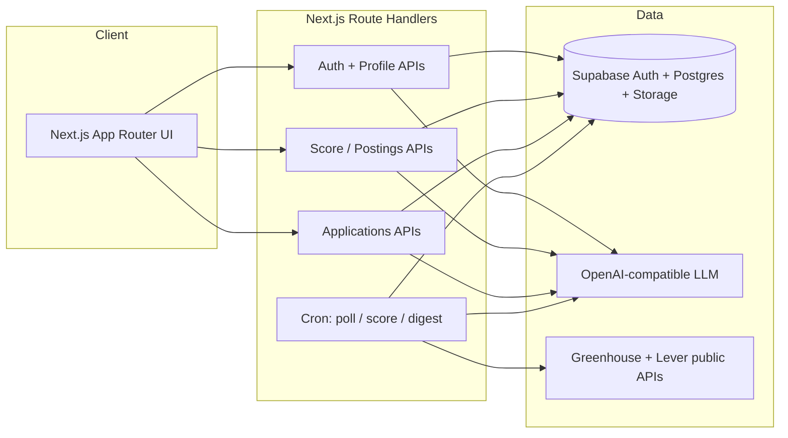
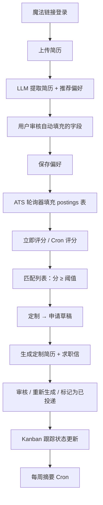
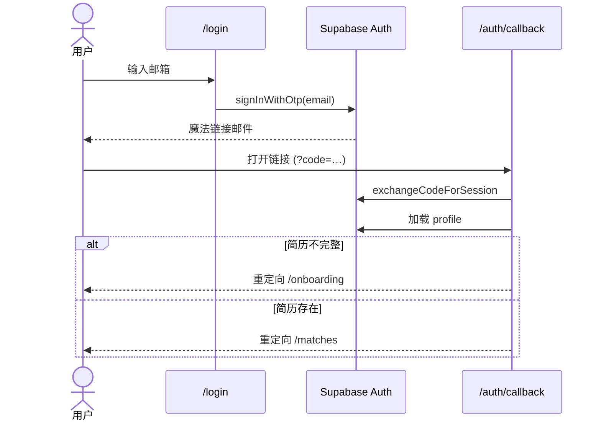
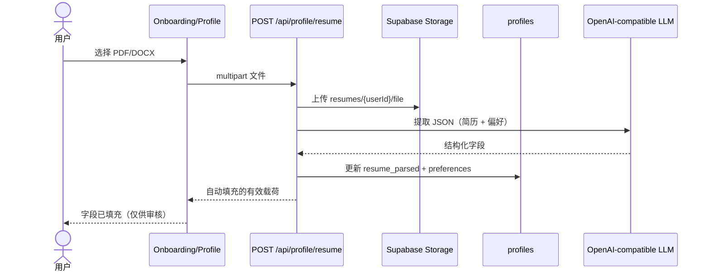
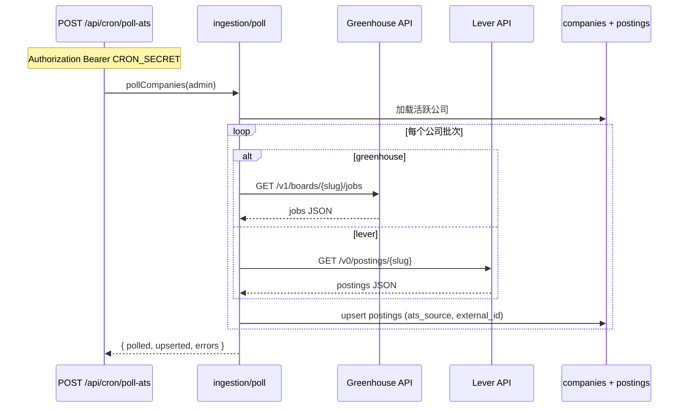
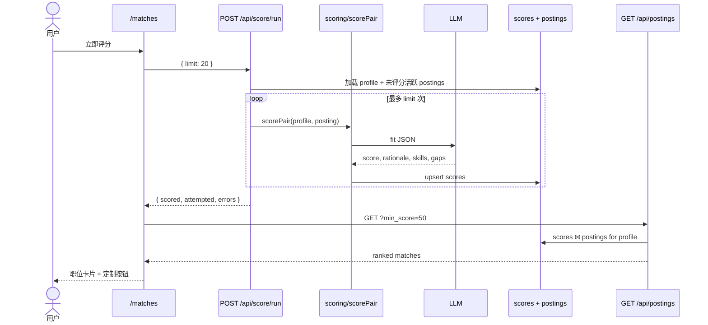
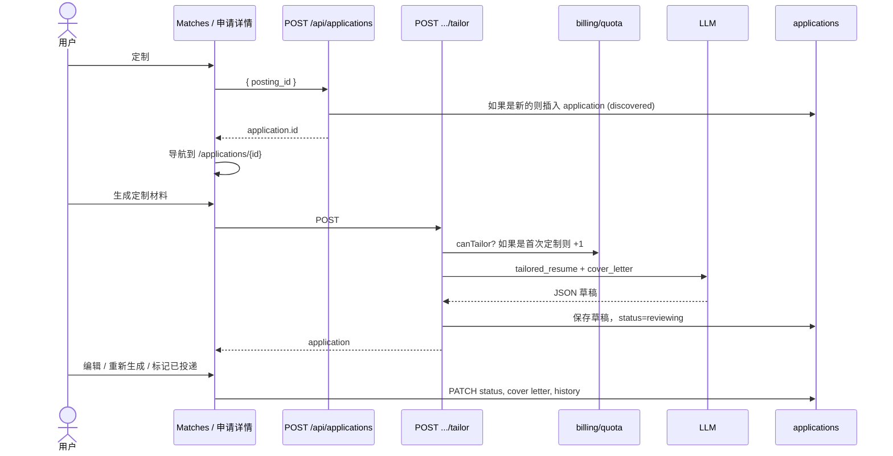
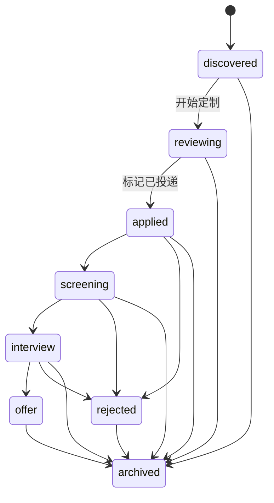

# JobPilot — 当前实现工作流

**最后更新：** 2026-07-11  
**配套文档：** `docs/superpowers/specs/2026-07-11-jobpilot-design.md`  
**另见：** 根目录 `README.md`（设置）、`docs/01-jobpilot-product-spec.md`（原始规格）

本文档描述当前运行中的应用程序实际做什么：用户流程、后端任务和时序图。当产品规格仍提及延期项目（如面试准备）时，这是*已实现行为*的事实来源。

---

## 1. 高层架构



**模块（位于 `src/lib/`）：**

| 模块 | 职责 |
|---|---|
| `ingestion/` | 轮询 Greenhouse/Lever → upsert `jp_postings` |
| `scoring/` | LLM 适配分 → `jp_scores` |
| `tailoring/` | LLM 简历 / 求职信草稿 → `jp_applications` |
| `applications/` | 状态机 |
| `billing/` | 配额 + Mock Stripe |
| `notifications/` | 每周摘要 + Mock Email |
| `profile/` | 简历解析 / 偏好提取 |

---

## 2. 端到端产品工作流



---

## 3. 时序图

### 3.1 认证（魔法链接）



### 3.2 上传简历 → 自动填充表单



无需重新上传即可重新提取：`POST /api/profile/resume/reparse` 下载存储的文件并运行相同的 LLM 路径。

### 3.3 职位发现（数据获取）



### 3.4 评分 → 匹配列表



Cron 替代方案：`POST /api/cron/score`（服务角色 + `CRON_SECRET`）批量处理所有活跃 profile。

### 3.5 定制 → 审核 → 投递



### 3.6 Kanban 跟踪



无效转换由 `src/lib/applications/status.ts` 中的 `assertTransition` 拒绝。

---

## 4. 数据表（运行时）

| 表 | 写入方 | 读取方 |
|---|---|---|
| `jp_users` | 认证注册触发器 | 账单 / 摘要 |
| `jp_profiles` | 简历上传 / profile PUT | 评分、匹配列表门槛 |
| `jp_companies` | Seed SQL | 轮询器 |
| `jp_postings` | 轮询器 | 评分、匹配 join |
| `jp_scores` | 评分运行 / Cron | 匹配列表 |
| `jp_applications` | 定制流程 + Kanban PATCH | 跟踪器、审核 UI |
| `jp_usage_counters` | 定制增量 | 使用量页面 / 配额 |

---

## 5. 重要 API 映射

| 方法 | 路径 | 调用方 | 用途 |
|---|---|---|---|
| POST | `/api/profile/resume` | 用户 | 上传 + LLM 自动填充 |
| POST | `/api/profile/resume/reparse` | 用户 | 从存储的文件重新提取 |
| GET/PUT | `/api/profile` | 用户 | 读取 / 更新 profile |
| POST | `/api/score/run` | 用户 | 为我的 profile 评分 |
| GET | `/api/postings?min_score=` | 用户 | 匹配列表 |
| POST | `/api/applications` | 用户 | 创建申请草稿 |
| POST | `/api/applications/:id/tailor` | 用户 | 生成草稿（配额） |
| POST | `/api/applications/:id/regenerate` | 用户 | 免费重新生成 |
| PATCH | `/api/applications/:id` | 用户 | 状态 / 备注 / 求职信 |
| POST | `/api/cron/poll-ats` | Cron 密钥 | 获取职位 |
| POST | `/api/cron/score` | Cron 密钥 | 批量评分所有 profile |
| POST | `/api/cron/digest` | Cron 密钥 | 每周邮件 |

---

## 6. 为什么 Matches 可能显示为空

Matches 仅显示 `jp_scores` 表中**您的** profile 超过 `min_score` 的行。

典型的首次运行状态：

1. 轮询器已填充 `jp_postings`（数千个职位）✓  
2. Profile 有 `resume_parsed` ✓  
3. `jp_scores` 仍然为空 ✗ → Matches 显示为空  

**UI 修复：** 打开 Matches → **立即评分**（调用 `/api/score/run`）。重复直到出现足够的高适配职位。如有需要可降低最低分数。

---

## 7. 本地运维速查表

```bash
# 从 env 文件加载 cron 密钥
export CRON_SECRET="$(grep '^CRON_SECRET=' .env.local | cut -d= -f2-)"

# 获取 / 刷新职位
curl -X POST -H "Authorization: Bearer $CRON_SECRET" \
  http://localhost:3000/api/cron/poll-ats

# 批量评分（所有 profile）— 或使用 Matches UI 按钮仅为您的用户评分
curl -X POST -H "Authorization: Bearer $CRON_SECRET" \
  http://localhost:3000/api/cron/score
```

LLM 路径使用的环境变量：`OPENAI_COMPATIBLE_BASE_URL`、`OPENAI_COMPATIBLE_API_KEY`、`OPENAI_COMPATIBLE_MODEL`。
