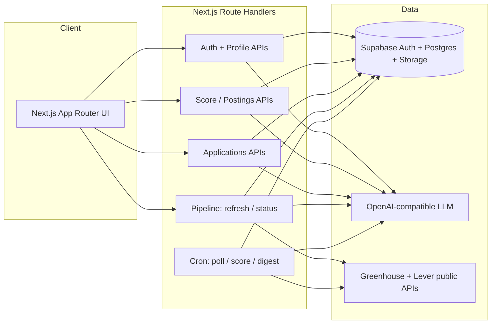
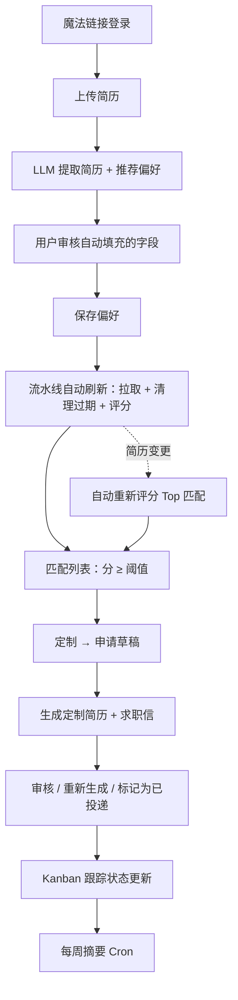
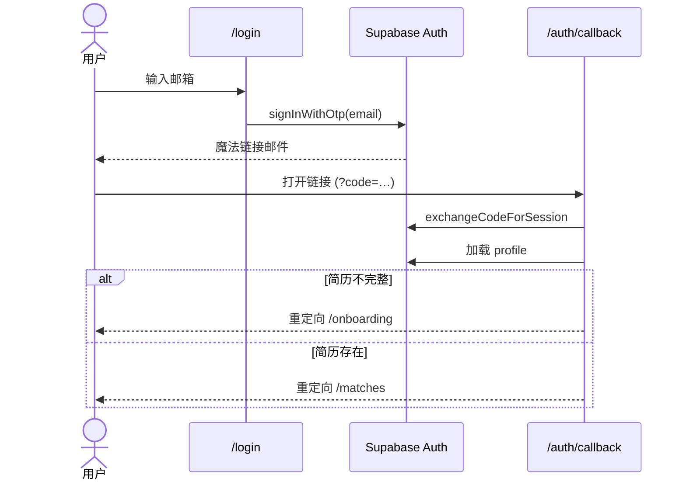
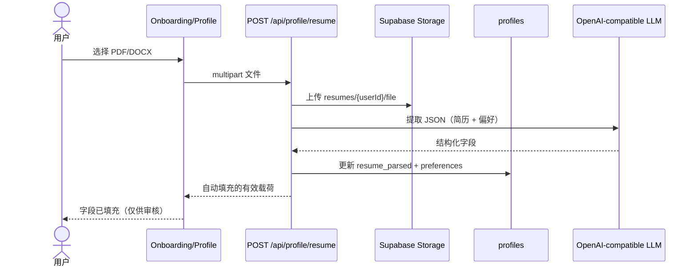
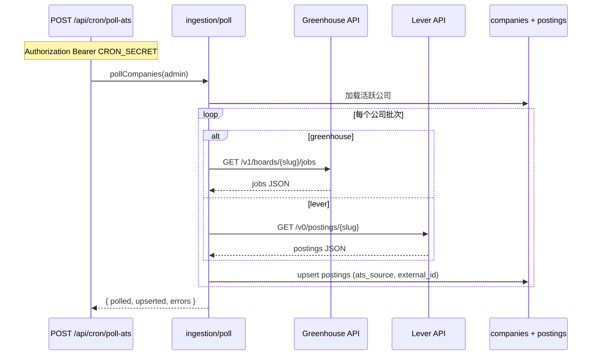
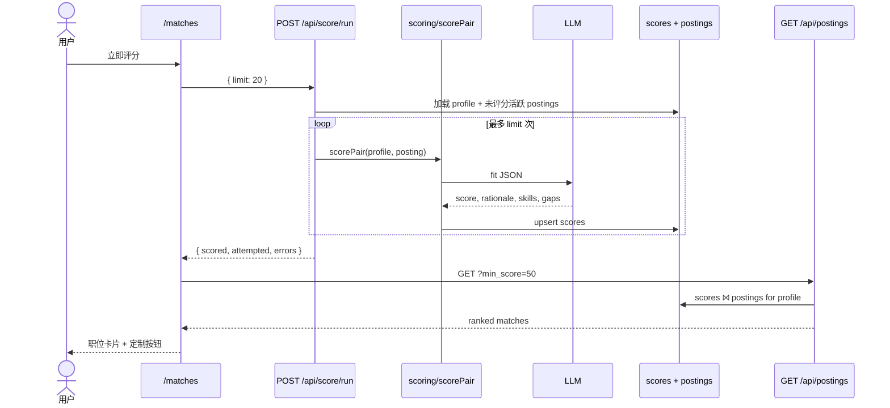
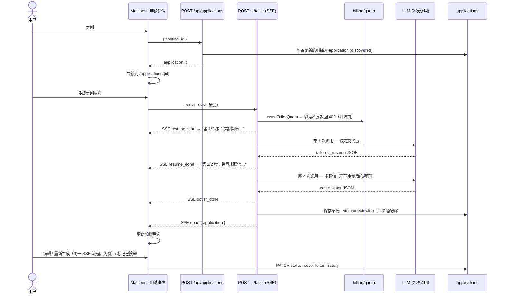
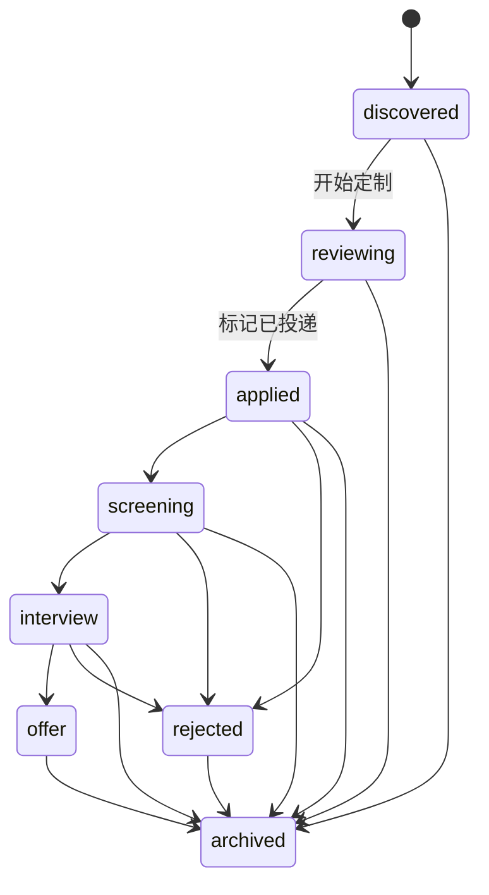

# JobPilot — 当前实现工作流

**最后更新：** 2026-08-05  
**配套文档：** `docs/superpowers/specs/2026-07-11-jobpilot-design.md`  
**另见：** 根目录 `README.md`（设置）、`docs/01-jobpilot-product-spec.md`（原始规格）

本文档描述当前运行中的应用程序实际做什么：用户流程、后端任务和时序图。当产品规格仍提及延期项目（如面试准备）时，这是*已实现行为*的事实来源。

---

## 1. 高层架构



**模块（位于 `src/lib/`）：**

| 模块 | 职责 |
|---|---|
| `ingestion/` | 轮询 6 个 ATS 来源 → upsert `jp_postings` |
| `scoring/` | LLM 适配分 → `jp_scores`，支持 SSE 流式 |
| `tailoring/` | 拆分 + SSE 流式的简历 / 求职信草稿 → `jp_applications` |
| `applications/` | 状态机 + 陈旧检测 |
| `billing/` | 配额 + Mock Stripe |
| `notifications/` | 每周摘要 + Mock Email |
| `profile/` | 简历解析 / 偏好提取 |
| `pipeline/` | 自刷新流水线：拉取 → 清理过期 → 评分 → 重新评分（锁 + TTL） |
| `matches/` | 匹配列表的已投递过滤辅助 |

---

## 2. 端到端产品工作流



---

## 3. 时序图

### 3.1 认证（魔法链接）



### 3.2 上传简历 → 自动填充表单



无需重新上传即可重新提取：`POST /api/profile/resume/reparse` 下载存储的文件并运行相同的 LLM 路径。

### 3.3 职位发现（数据获取）



**过期职位清理：** 流水线随后执行 `deactivateStalePostings()` — 任何 `last_seen_at`
超过 **30 天** 的职位会被设为 `is_active = false`，从 Browse 和 Matches 中移除。
重新出现在 ATS 板上的职位会被 upsert 自动重新激活。

### 3.4 评分 → 匹配列表



Cron 替代方案：`POST /api/cron/score`（服务角色 + `CRON_SECRET`）批量处理所有活跃 profile。

**简历变更重新评分：** `/api/score/run` 支持 `force: true`（Matches 页「重新评分」按钮），
对当前用户已评分的 Top 职位强制重新评分。后台流水线中的 `rescoreChangedProfiles()`
会比较 `jp_profiles` 上的 `resume_fingerprint` 哈希；当简历变更时，对该 profile
的 Top ~50 个职位强制重新评分。首次运行仅回填指纹，**无** LLM 开销。

### 3.5 定制 → 审核 → 投递



定制已拆分为**两次 LLM 调用**（先简历，再基于定制简历撰写求职信），并通过 **SSE 流式**返回，
每部分更快完成，UI 显示实时分步进度而非空白等待。
`POST /api/applications/:id/regenerate` 使用相同流式流程（`countAgainstQuota: false`，首次定制后免费）。

### 3.6 Kanban 跟踪



无效转换由 `src/lib/applications/status.ts` 中的 `assertTransition` 拒绝。

---

## 4. 数据表（运行时）

| 表 | 写入方 | 读取方 |
|---|---|---|
| `jp_users` | 认证注册触发器 | 账单 / 摘要 |
| `jp_profiles` | 简历上传 / profile PUT | 评分、匹配列表门槛；`resume_fingerprint` 由流水线重新评分写入 |
| `jp_companies` | Seed SQL | 轮询器 |
| `jp_postings` | 轮询器；过期清理设置 `is_active=false` | 评分、匹配 join |
| `jp_scores` | 评分运行 / Cron / 流水线重新评分 | 匹配列表 |
| `jp_applications` | 定制流程 + Kanban PATCH | 跟踪器、审核 UI、匹配已投递过滤 |
| `jp_usage_counters` | 定制增量 | 使用量页面 / 配额 |
| `jp_pipeline_state` | 流水线（锁 + TTL 时间戳） | `/api/pipeline/status`、惰性触发 |

---

## 5. 重要 API 映射

| 方法 | 路径 | 调用方 | 用途 |
|---|---|---|---|
| POST | `/api/profile/resume` | 用户 | 上传 + LLM 自动填充 |
| POST | `/api/profile/resume/reparse` | 用户 | 从存储的文件重新提取 |
| GET/PUT | `/api/profile` | 用户 | 读取 / 更新 profile |
| POST | `/api/score/run` | 用户 | 为我的 profile 评分（SSE 流式；`force: true` 重新评分） |
| GET | `/api/postings?min_score=` | 用户 | 匹配列表（默认隐藏已投递，除非 `include_applied=1`） |
| GET | `/api/postings/browse` | 公开 | 浏览所有活跃职位（触发惰性刷新） |
| GET | `/api/stats` | 用户 | 流水线健康（计数、时间戳；触发惰性刷新） |
| GET | `/api/pipeline/status` | 用户 | 流水线新鲜度（`last_poll_at`、`stale`、`running`） |
| POST | `/api/pipeline/run` | 用户 | 手动「立即刷新」— 后台 拉取+清理+评分 |
| POST | `/api/applications` | 用户 | 创建申请草稿 |
| POST | `/api/applications/:id/tailor` | 用户 | 生成草稿（配额；SSE 流式，简历 → 求职信） |
| POST | `/api/applications/:id/regenerate` | 用户 | 免费重新生成（SSE 流式） |
| PATCH | `/api/applications/:id` | 用户 | 状态 / 备注 / 求职信 |
| POST | `/api/cron/poll-ats` | Cron 密钥 | 获取职位 |
| POST | `/api/cron/score` | Cron 密钥 | 批量评分所有 profile |
| POST | `/api/cron/digest` | Cron 密钥 | 每周邮件 |

---

## 6. 为什么 Matches 可能显示为空

Matches 仅显示 `jp_scores` 表中**您的** profile 超过 `min_score` 的行，并默认隐藏已投递
的职位（除非开启「显示已投递」开关）。

典型的首次运行状态：

1. 流水线自动刷新填充 `jp_postings`（数千个职位）✓  
2. Profile 有 `resume_parsed` ✓  
3. `jp_scores` 仍然为空 ✗ → **自动评分自动触发！**
4. 进度条显示「正在评分 1/20 · Stripe SWE…」
5. 评分完成后匹配列表出现

Matches 页面在职位或评分仍为空时（后台正在构建数据）每 ~8 秒自动刷新一次，
无需手动刷新即可自动填充。

职位新鲜度：超过 30 天未出现的职位会被停用并从列表中移除，因此 Matches / Browse 反映的是
实时市场而非陈旧快照。更新简历后评分会自动刷新（基于指纹的重新评分），也可通过
**重新评分**按钮手动触发。

---

## 7. 本地运维速查表

```bash
# 流水线会在访问页面时自动刷新（惰性 TTL，>6 小时）。以下为手动触发：

# 手动刷新（需登录用户）— 相当于「立即刷新」按钮：
curl -X POST -H "Content-Type: application/json" \
  http://localhost:5200/api/pipeline/run -d "{}"

# 查看流水线新鲜度：
curl http://localhost:5200/api/pipeline/status
# → { "last_poll_at": "...", "stale": false, "running": false }

# Cron 路径（仍然可用；需要 CRON_SECRET）：
export CRON_SECRET="$(grep '^CRON_SECRET=' .env.local | cut -d= -f2-)"
curl -X POST -H "Authorization: Bearer $CRON_SECRET" \
  http://localhost:5200/api/cron/poll-ats
curl -X POST -H "Authorization: Bearer $CRON_SECRET" \
  http://localhost:5200/api/cron/score
```

LLM 路径使用的环境变量：`OPENAI_COMPATIBLE_BASE_URL`、`OPENAI_COMPATIBLE_API_KEY`、`OPENAI_COMPATIBLE_MODEL`。
