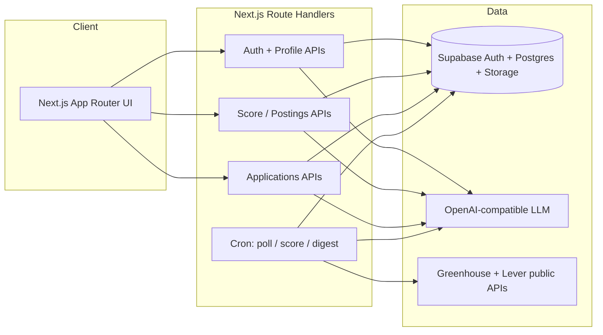
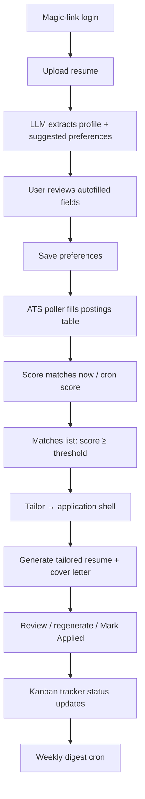
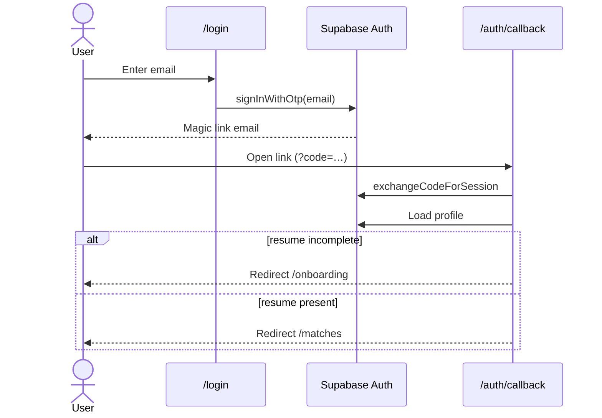
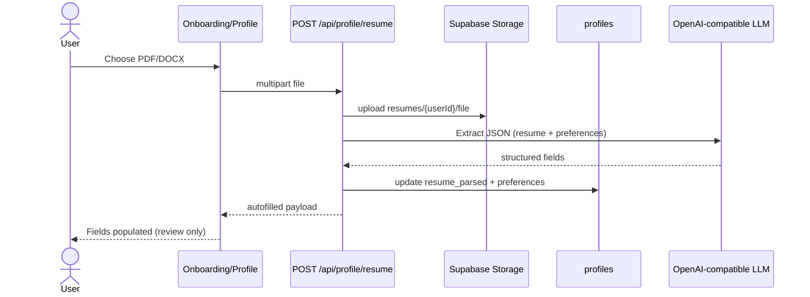
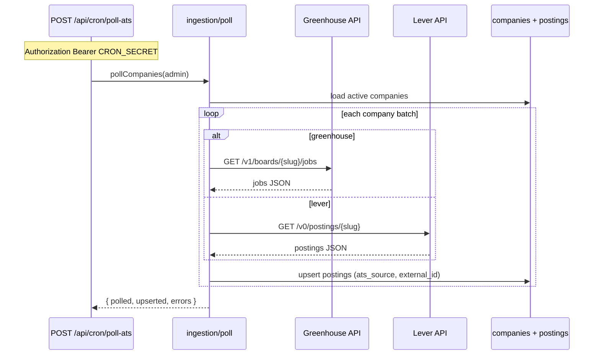
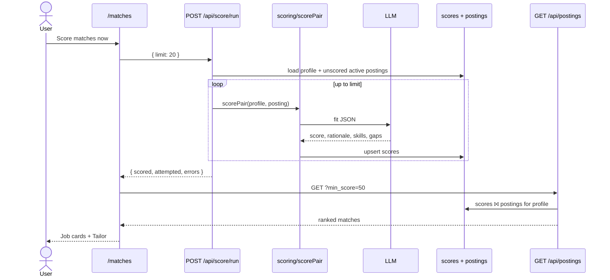
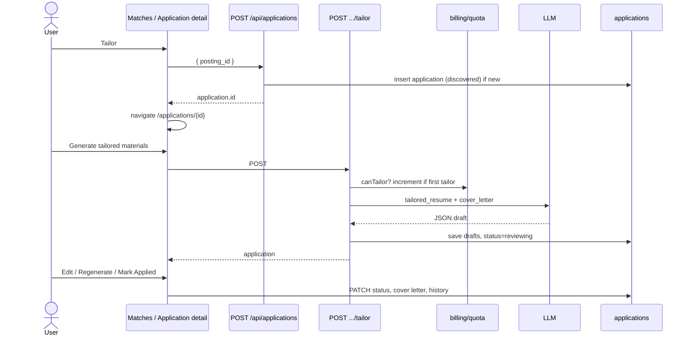
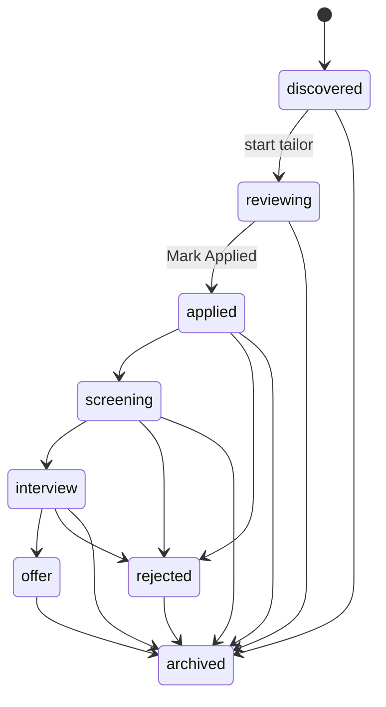

# JobPilot — Current Implementation Workflow

**Last updated:** 2026-07-11  
**Companion:** `docs/superpowers/specs/2026-07-11-jobpilot-design.md`  
**Also see:** root `README.md` (setup), `docs/01-jobpilot-product-spec.md` (original spec)

This document describes what the running app does today: user flows, background jobs, and sequence diagrams. It is the source of truth for *implemented* behavior when product specs still mention deferred items (e.g. interview prep).

---

## 1. High-level architecture



**Modules (under `src/lib/`):**

| Module | Role |
|---|---|
| `ingestion/` | Poll Greenhouse/Lever → upsert `postings` |
| `scoring/` | LLM fit score → `scores` |
| `tailoring/` | LLM resume/cover letter drafts → `applications` |
| `applications/` | Status state machine |
| `billing/` | Quota + mock Stripe |
| `notifications/` | Weekly digest + mock email |
| `profile/` | Resume parse / preference extract |

---

## 2. End-to-end product workflow



---

## 3. Sequence diagrams

### 3.1 Auth (magic link)



### 3.2 Resume upload → autofill form



Re-extract without re-upload: `POST /api/profile/resume/reparse` downloads the stored file and runs the same LLM path.

### 3.3 Job discovery (ingestion)



### 3.4 Scoring → Matches list



Cron alternative: `POST /api/cron/score` (service role + `CRON_SECRET`) batches all active profiles.

### 3.5 Tailor → review → apply



### 3.6 Kanban tracking



Invalid transitions are rejected by `assertTransition` in `src/lib/applications/status.ts`.

---

## 4. Data tables (runtime)

| Table | Written by | Read by |
|---|---|---|
| `users` | Auth signup trigger | Billing / digest |
| `profiles` | Resume upload / profile PUT | Scoring, Matches gate |
| `companies` | Seed SQL | Poller |
| `postings` | Poller | Scoring, Matches join |
| `scores` | Score run / cron | Matches list |
| `applications` | Tailor flow + Kanban PATCH | Tracker, review UI |
| `usage_counters` | Tailor increment | Usage page / quota |

---

## 5. Important API map

| Method | Path | Who | Purpose |
|---|---|---|---|
| POST | `/api/profile/resume` | User | Upload + LLM autofill |
| POST | `/api/profile/resume/reparse` | User | Re-extract stored file |
| GET/PUT | `/api/profile` | User | Read/update profile |
| POST | `/api/score/run` | User | Score my profile vs jobs |
| GET | `/api/postings?min_score=` | User | Matches list |
| POST | `/api/applications` | User | Create application shell |
| POST | `/api/applications/:id/tailor` | User | Generate drafts (quota) |
| POST | `/api/applications/:id/regenerate` | User | Free regenerate |
| PATCH | `/api/applications/:id` | User | Status / notes / cover letter |
| POST | `/api/cron/poll-ats` | Cron secret | Ingest jobs |
| POST | `/api/cron/score` | Cron secret | Batch score all profiles |
| POST | `/api/cron/digest` | Cron secret | Weekly email |

---

## 6. Why Matches can look empty

Matches only lists rows in `scores` for **your** profile above `min_score`.

Typical first-run state:

1. Poller has filled `postings` (thousands of jobs) ✓  
2. Profile has `resume_parsed` ✓  
3. `scores` is still empty ✗ → Matches shows empty  

**Fix in UI:** open Matches → **Score matches now** (calls `/api/score/run`). Repeat until enough high-fit jobs appear. Lower min score if needed.

---

## 7. Local operator cheatsheet

```bash
# Load cron secret from env file
export CRON_SECRET="$(grep '^CRON_SECRET=' .env.local | cut -d= -f2-)"

# Ingest / refresh jobs
curl -X POST -H "Authorization: Bearer $CRON_SECRET" \
  http://localhost:3000/api/cron/poll-ats

# Batch score (all profiles) — or use Matches UI button for your user only
curl -X POST -H "Authorization: Bearer $CRON_SECRET" \
  http://localhost:3000/api/cron/score
```

Env used by LLM paths: `OPENAI_COMPATIBLE_BASE_URL`, `OPENAI_COMPATIBLE_API_KEY`, `OPENAI_COMPATIBLE_MODEL`.
