# JobPilot — Current Implementation Workflow

**Last updated:** 2026-08-05  
**Companion:** `docs/superpowers/specs/2026-07-11-jobpilot-design.md`  
**Also see:** root `README.md` (setup), `docs/01-jobpilot-product-spec.md` (original spec)

This document describes what the running app does today: user flows, background jobs, and sequence diagrams. It is the source of truth for *implemented* behavior when product specs still mention deferred items (e.g. interview prep).

---

## 1. High-level architecture

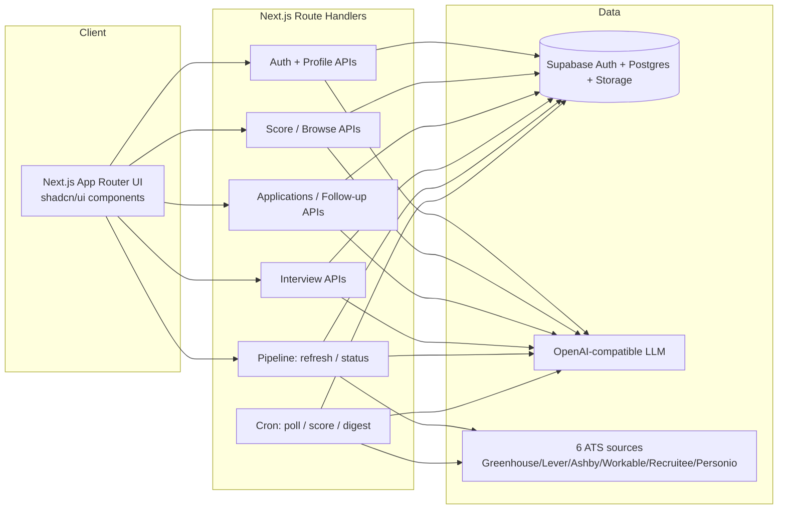

**Modules (under `src/lib/`):**

| Module | Role |
|---|---|
| `ingestion/` | Poll 6 ATS sources → upsert `jp_postings` |
| `scoring/` | LLM fit score → `jp_scores`, with SSE streaming |
| `tailoring/` | Split + SSE-streamed resume/cover letter drafts → `jp_applications` |
| `applications/` | Status state machine + stale detection |
| `billing/` | Quota + mock Stripe |
| `notifications/` | Weekly digest + mock email |
| `profile/` | Resume parse / preference extract |
| `stream/` | SSE streaming helper (Web Streams API) |
| `pipeline/` | Auto-refresh pipeline: poll → stale-sweep → score → rescore (lock + TTL) |
| `matches/` | Applied-job filtering helper for the matches feed |

---

## 2. End-to-end product workflow

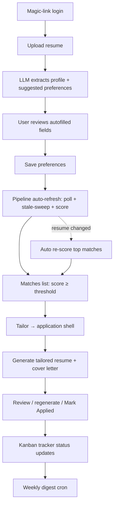

---

## 3. Sequence diagrams

### 3.1 Auth (magic link)

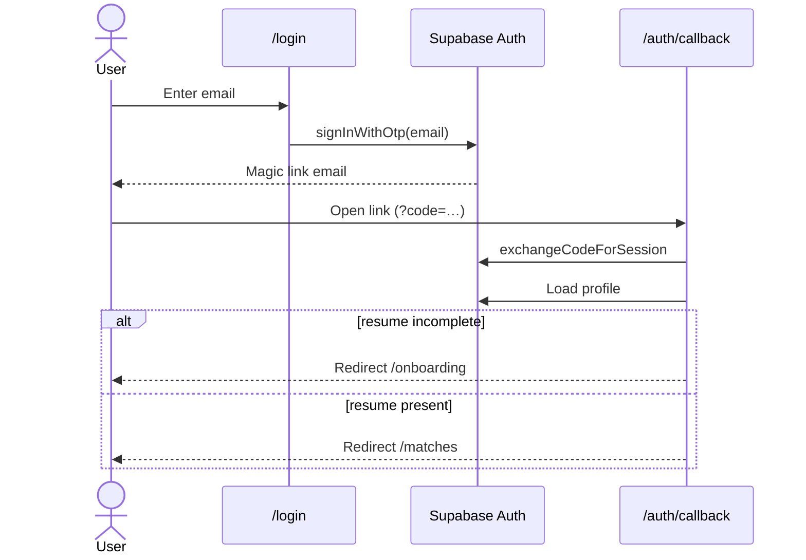

### 3.2 Resume upload → autofill form

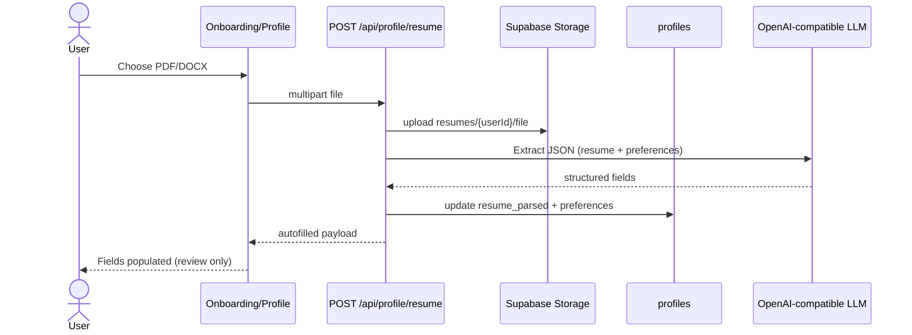

Re-extract without re-upload: `POST /api/profile/resume/reparse` downloads the stored file and runs the same LLM path.

### 3.3 Job discovery (ingestion)

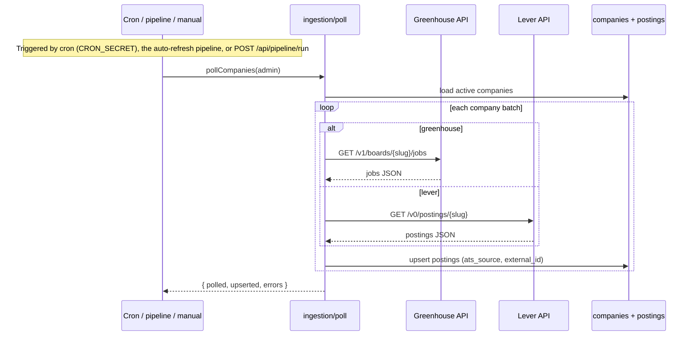

**Stale-job sweep:** the pipeline then runs `deactivateStalePostings()` — any posting whose
`last_seen_at` is older than **30 days** is set `is_active = false` and drops out of Browse and
Matches. Postings that reappear on the board are reactivated automatically by the upsert.

### 3.4 Scoring → Matches list

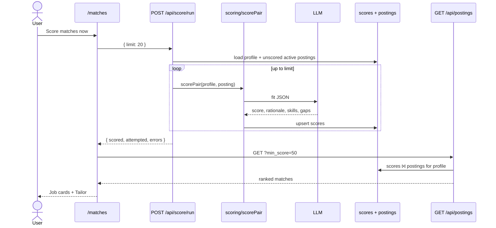

Cron alternative: `POST /api/cron/score` (service role + `CRON_SECRET`) batches all active profiles.

**Re-scoring on resume change:** `/api/score/run` also accepts `force: true` (the Matches
"Re-score matches" button) to re-score the current user's top-ranked jobs even if already scored.
In the background pipeline, `rescoreChangedProfiles()` compares a `resume_fingerprint` hash on
`jp_profiles`; when the resume changes, it force re-scores the top ~50 ranked jobs for that
profile. Fingerprints are backfilled on first run with **no** LLM cost.

### 3.5 Tailor → review → apply

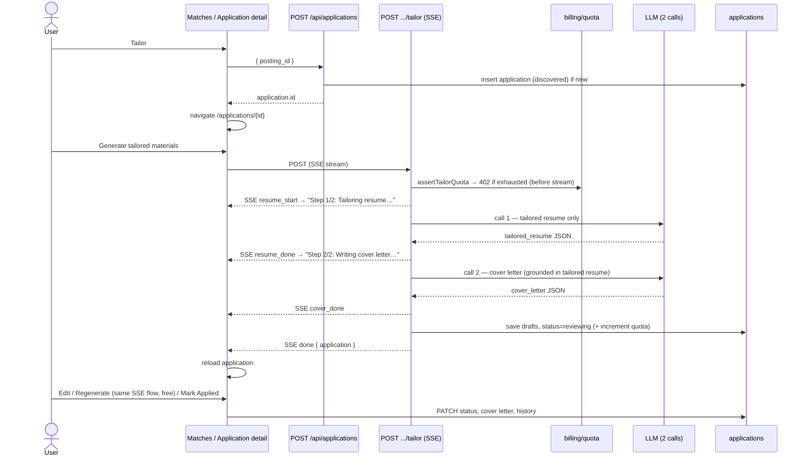

Tailoring is **split into two LLM calls** (resume, then cover letter grounded in the tailored
resume) and **streamed over SSE**, so each piece lands faster and the UI shows live step progress
instead of a blank wait. `POST /api/applications/:id/regenerate` uses the same streamed flow with
`countAgainstQuota: false` (free after the first tailor).

### 3.6 Kanban tracking

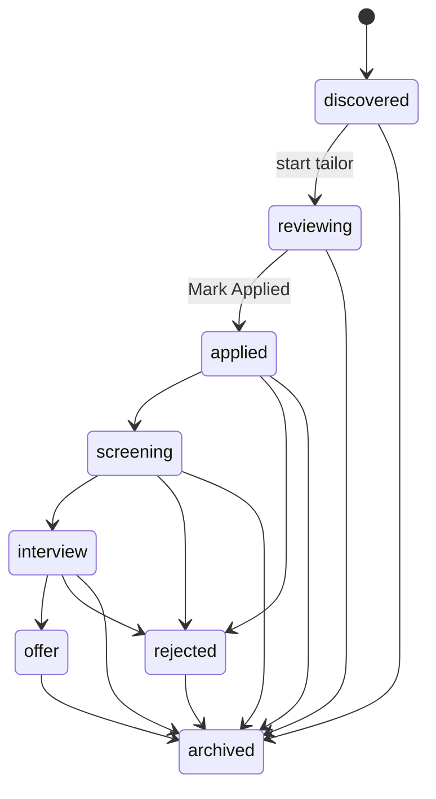

Invalid transitions are rejected by `assertTransition` in `src/lib/applications/status.ts`.

---

## 4. Data tables (runtime)

| Table | Written by | Read by |
|---|---|---|
| `jp_users` | Auth signup trigger | Billing / digest |
| `jp_profiles` | Resume upload / profile PUT | Scoring, Matches gate; `resume_fingerprint` written by pipeline rescore |
| `jp_companies` | Seed SQL | Poller |
| `jp_postings` | Poller (6 ATS sources); stale-sweep sets `is_active=false` | Scoring, Browse page, Matches join |
| `jp_scores` | Score run / cron / pipeline rescore | Matches list |
| `jp_applications` | Tailor flow + Kanban PATCH | Tracker, review UI, follow-up, Matches applied-filter |
| `jp_interview_sessions` | Interview generate / evaluate | Interview UI, report |
| `jp_usage_counters` | Tailor increment | Usage page / quota |
| `jp_pipeline_state` | Pipeline (lock + TTL timestamps) | `/api/pipeline/status`, lazy trigger |

---

## 8. Important API map

| Method | Path | Who | Purpose |
|---|---|---|---|
| POST | `/api/profile/resume` | User | Upload + LLM autofill |
| POST | `/api/profile/resume/reparse` | User | Re-extract stored file |
| GET/PUT | `/api/profile` | User | Read/update profile |
| POST | `/api/score/run` | User | Score my profile vs jobs (SSE streaming; `force: true` re-scores) |
| GET | `/api/postings?min_score=` | User | Matches list (scored only; hides applied unless `include_applied=1`) |
| GET | `/api/postings/browse` | Public | Browse all active postings (triggers lazy refresh) |
| GET | `/api/stats` | User | Pipeline health (counts, timestamps; triggers lazy refresh) |
| GET | `/api/pipeline/status` | User | Pipeline freshness (`last_poll_at`, `stale`, `running`) |
| POST | `/api/pipeline/run` | User | Manual "Refresh now" — poll + stale-sweep + score in background |
| POST | `/api/applications` | User | Create application shell |
| POST | `/api/applications/:id/tailor` | User | Generate drafts (quota; SSE streamed, resume → cover letter) |
| POST | `/api/applications/:id/regenerate` | User | Free regenerate (SSE streamed) |
| POST | `/api/applications/:id/follow-up` | User | Draft follow-up email |
| PATCH | `/api/applications/:id` | User | Status / notes / cover letter |
| POST | `/api/interview/generate` | User | Generate interview questions |
| POST | `/api/interview/evaluate` | User | Evaluate answer + STAR feedback |
| POST | `/api/cron/poll-ats` | Cron secret | Ingest 6 ATS sources |
| POST | `/api/cron/score` | Cron secret | Batch score all profiles |
| POST | `/api/cron/digest` | Cron secret | Weekly email |

---

## 6. New workflows (Phase 2)

### 6.1 Browse all jobs

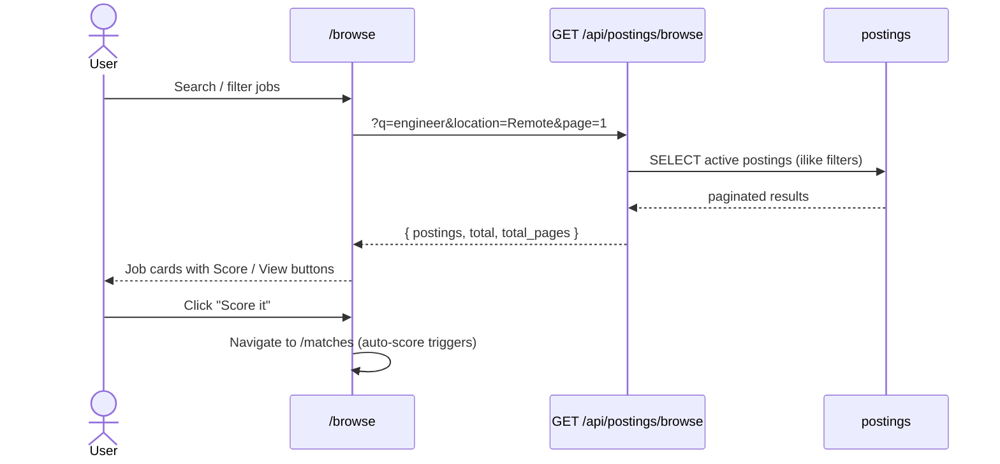

### 6.2 Mock interview

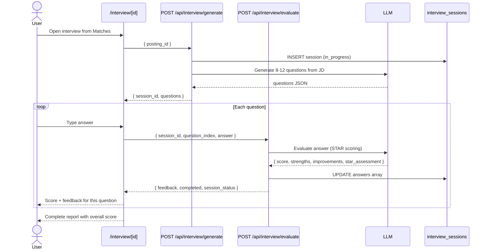

### 6.3 Stale follow-up

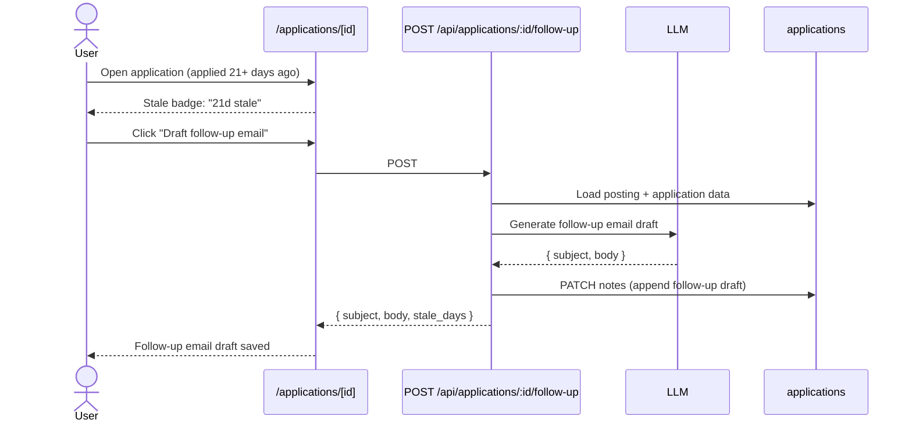

### 6.4 Auto-scoring

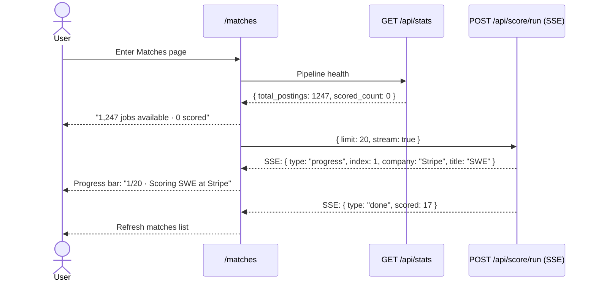

### 6.5 Self-refreshing pipeline (auto-refresh)

The app is self-sustaining: no external scheduler is required. Any visit to `/browse`
(the public browse API) or `/matches` (via `/api/stats`) calls `maybeTriggerPipeline()`; if it's
been >6h since the last poll and no run is live, it kicks off `runPipeline()` **after** the
response is sent (`next/server` `after()`). A DB lock (`jp_pipeline_state.running` +
`running_at`, with a 15-min stale timeout) serializes concurrent runs across requests/instances.

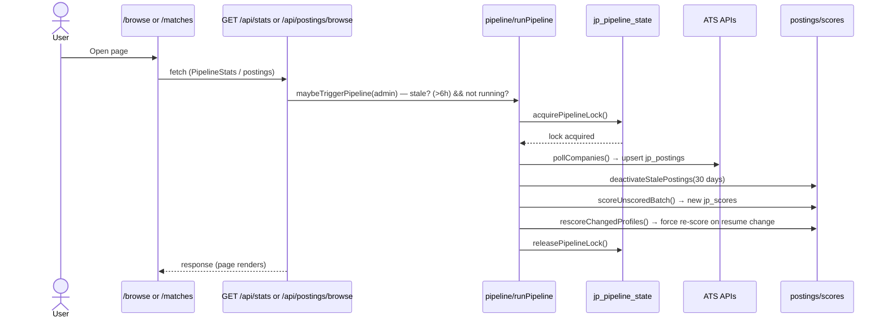

Manual refresh: **"Refresh now"** on `/browse` → `POST /api/pipeline/run` (409 if a run is
live). Freshness is surfaced by `GET /api/pipeline/status` → `{ last_poll_at, stale, running }`.

## 7. Why Matches can look empty

Matches only lists rows in `jp_scores` for **your** profile above `min_score`, and hides jobs you've
already applied to (unless the "Show applied" toggle is on).

Typical first-run state:

1. Pipeline auto-refresh fills `jp_postings` (thousands of jobs) ✓  
2. Profile has `resume_parsed` ✓  
3. `jp_scores` is still empty ✗ → **Auto-score triggers automatically!**
4. Progress bar shows "Scoring 1/20 · Stripe SWE…"
5. Matches appear as scoring completes

The Matches page self-refreshes every ~8s while postings or scores are still empty (data is being
built in the background), so it fills in without a manual reload.

Job freshness: postings unseen for 30 days are deactivated and leave the list, so Matches/Browse
reflect the live market rather than a stale snapshot. Scores refresh automatically when you update
your resume (fingerprint-based re-score), or on demand via **Re-score matches**.

You can also browse all postings at `/browse` before scoring — search, filter, "Refresh now", and
trigger scoring on individual jobs.

---

## 7. Local operator cheatsheet

```bash
# The pipeline self-refreshes on page visits (lazy TTL, >6h). Manual triggers:

# Manual refresh (authenticated) — "Refresh now" button, or:
curl -X POST -H "Content-Type: application/json" \
  http://localhost:5200/api/pipeline/run -d "{}"

# Pipeline freshness:
curl http://localhost:5200/api/pipeline/status
# → { "last_poll_at": "...", "stale": false, "running": false }

# Cron path (still available; requires CRON_SECRET):
export CRON_SECRET="$(grep '^CRON_SECRET=' .env.local | cut -d= -f2-)"
curl -X POST -H "Authorization: Bearer $CRON_SECRET" \
  http://localhost:5200/api/cron/poll-ats
curl -X POST -H "Authorization: Bearer $CRON_SECRET" \
  http://localhost:5200/api/cron/score
```

Env used by LLM paths: `OPENAI_COMPATIBLE_BASE_URL`, `OPENAI_COMPATIBLE_API_KEY`, `OPENAI_COMPATIBLE_MODEL`.
