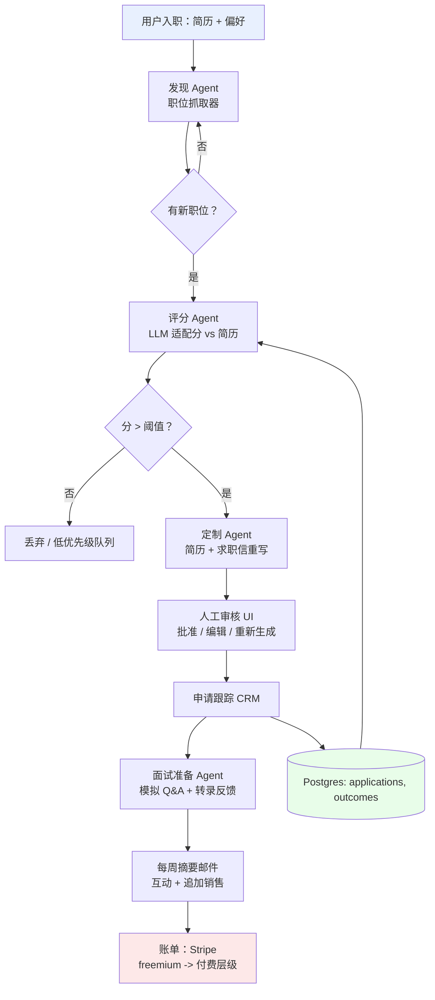
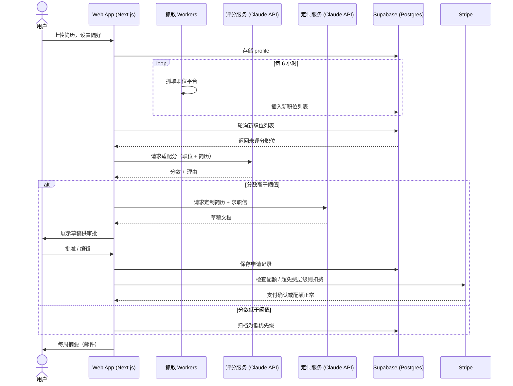

# 级联 GitHub Pipeline 玩法：从趋势开源项目构建可变现产品

*调研日期：2026 年 7 月 11 日*

## 当前真正热门的东西（已验证，非直觉）

数据来源：GitHub Trending、Trendshift、OSSInsight 及独立开发者收入数据（本周）：

| 项目 / 趋势 | 信号 | 为什么重要 |
|---|---|---|
| `MadsLorentzen/ai-job-search` | 17k★，本月 +4.5k | AI Agent 评估职位、定制 CV、撰写求职信、面试准备 — 基于 Claude Code 构建 |
| `usestrix/strix` | 12.3k★，本月 +1.1k | 开源 AI 渗透测试 Agent |
| `langchain-ai/openwiki` | 10.5k★，本月 +704 | CLI，为代码库编写 / 维护 Agent 友好的文档 |
| `Zackriya-Solutions/meetily` | 9.9k★，本月 +1k | 本地优先的会议转录 + 笔记 |
| Agentic 视频制作仓库（12 条 Pipeline，52 个工具，500+ 技能） | 今日 GitHub Trending | 将编码 Agent 变成完整视频工作室 |
| Bumblebee（Perplexity） | 2.6k★，快速增长 | MCP 服务器 / 扩展的供应链扫描器 |
| MCP 代码智能服务器 | 趋势 | 将代码库索引为知识图谱供 Agent 使用 |
| "Skills" 生态系统（`awesome-claude-skills`，Karpathy 衍生的 CLAUDE.md 规则 156k★） | 爆发式增长 | 编码 Agent 的编码偏好行为包 |

结合独立开发者收入数据（Indie Hackers、MicroConf、Freemius 2025 基准）交叉分析：**AI-Agent 包裹痛苦的手动工作流**模式是当前真正实现 MRR 的赢家，尤其适用于高频、反复出现、情绪上高风险的痛点（找工作、会议跟进、内容再利用、代码审查、合规文档）。没有数据或工作流护城河的"纯 AI 包装器"工具死得最快（Gartner：到 2030 年，35% 的单点 SaaS 工具将被 AI Agent 取代）— 所以正确的做法是**将几个小型单一用途的开源项目串联成一条完整拥有的工作链**，而不是围绕一次 API 调用做一个薄包装。

---

## 推荐级联方案：**JobPilot** — AI 职业运营 Pipeline

**为什么选这个：** `ai-job-search` 是本列表中增长最快的 Trending 仓库（17k★，+4.5k/月），底层痛点（求职）是普遍存在、反复发生、情绪上高风险的（人们愿意为缓解焦虑付费），且可以干净地分解成一条由小型、可互换的开源组件组成的链 — 正是你所说的"级联"结构。

### Pipeline 组件（每个都是小型、可替换的 OSS 组件）

1. **发现** — 职位抓取器（基于 Playwright/Crawlee，与趋势上的 Yahoo Auction 抓取器相同模式）从 LinkedIn、Greenhouse、Lever API 拉取职位列表
2. **评分** — `ai-job-search` 评估逻辑的分叉：LLM 根据用户简历评分
3. **定制** — 简历 + 求职信重写 Agent（Claude API），每个申请版本受版本控制
4. **面试准备** — `meetily` 风格的本地转录重新用于模拟面试练习 + 反馈
5. **跟踪 / CRM** — 轻量级 Kanban（已投递 → 面试中 → 收到 offer）— 这是你的留存钩子和数据护城河（没人想在其他地方重新输入 200 份申请）
6. **分发循环** — 每周摘要邮件（Resend/Postmark）成为你的互动 + 追加销售渠道

### 商业化
- Freemium：每月免费 5 次定制申请
- $19–29/月：无限制定制 + 跟踪 + 面试准备
- $99 一次性："Crunch Mode" — 48 小时内投递 50 份申请，面向正在裁员的人
- 未来 B2B 角度：面向大学职业中心 / 离职服务公司的白标（更高 ACV，更低流失率）

### 技术栈（符合你现有的环境）
- Next.js + Supabase + Stripe + Vercel（2026 年独立开发者默认技术栈）
- Claude API 用于评分 / 定制 / 面试反馈
- Playwright/Crawlee 抓取 workers（容器化，队列化）
- 你的 ComfyUI/Pinokio 配置这里不需要，但可以为**第二个产品**提供动力：AI 头像生成作为入职时 $9 的追加销售（有先例 — 这是一个已被验证的微 SaaS 类别，而且你已经调试好了本地 Pipeline）

---

## 架构 — 级联 Pipeline（Mermaid 流程图）

---

## 请求流程 — 时序图（单个申请周期）

---

## 值得花 30 分钟验证的另外两个级联想法

**1. 内容再利用工作室**（直接匹配你的本地 ComfyUI 配置）
链路：转录（Whisper/`meetily` 模式）→ 再利用 Agent（一个视频 → LinkedIn/X/博客帖子）→ 本地图片生成（你现有的 ComfyUI/Pinokio Pipeline）用于缩略图 / 轮播图 → 自动排程。这是一个已被收入验证的类别（Opus、Daydreams 是竞品），这是你的 M3 Pro 图片生成工作从爱好项目变成直接产品资产的唯一地方。

**2. MCP/Agent-Skill 安全门**（开发者工具角度，匹配你的咨询背景）
链路：Bumblebee 风格扫描器 → VS Code 扩展审计（与你刚才调试的 Copilot bug 相关）→ CI/CD 门禁，阻止未经审核的 MCP 服务器 / Skills 在全公司安装。面向对该爆炸式增长的 MCP 供应链感到紧张的 IT 咨询公司和企业的销售，市场较小，但付费意愿高得多（$200–2000/月/公司），这是你已有 infra 工作的自然延伸。

---

## 构建前的验证

不要跳过这一步 — 54% 的独立开发者 SaaS 产品最终实现零收入，几乎总是因为创始人跳过了验证，不是因为代码写得差：

1. 在本周的 Reddit/X/Indie Hackers 上找到 10–20 个正在积极抱怨这个问题的人
2. 确认至少有几个人已经为更差的解决方案付过费
3. 在写 Pipeline 之前先上线一个着陆页 + 等待列表 — 在不到一周内验证付费意愿
4. 选择对"当 Claude/GPT 变得更好时会发生什么"回答最清晰的那个想法 — 找工作角度和咨询安全角度都比通用 AI 包装器更能通过这个测试

要我将 JobPilot 仓库结构（Next.js + Supabase + Agent 链路）搭建为实际启动项目，还是先做一个验证着陆页？
