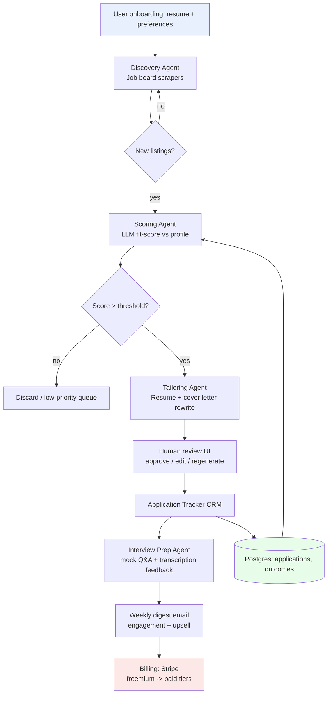
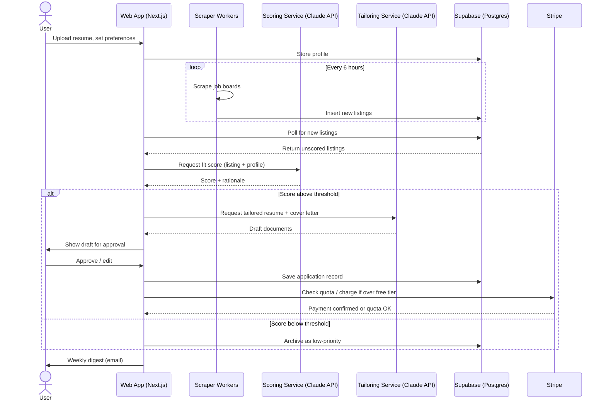

# Cascading GitHub Pipeline Playbook: Building a Monetizable Product from Trending OSS

*Research date: July 11, 2026*

## What's actually hot right now (verified, not vibes)

Pulled from GitHub Trending, Trendshift, OSSInsight, and indie-hacker revenue data as of this week:

| Repo / Trend | Signal | Why it matters |
|---|---|---|
| `MadsLorentzen/ai-job-search` | 17k★, +4.5k this month | AI agent that evaluates jobs, tailors CVs, writes cover letters, preps interviews — built on Claude Code |
| `usestrix/strix` | 12.3k★, +1.1k this month | Open-source AI pentesting agent |
| `langchain-ai/openwiki` | 10.5k★, +704 this month | CLI that writes/maintains agent-facing docs for a codebase |
| `Zackriya-Solutions/meetily` | 9.9k★, +1k this month | Local-first meeting transcription + notes |
| Agentic video production repo (12 pipelines, 52 tools, 500+ skills) | GitHub Trending today | Turns a coding agent into a full video studio |
| Bumblebee (Perplexity) | 2.6k★, fast growth | Supply-chain scanner for MCP servers/extensions |
| MCP code-intelligence servers | Trending | Index codebases into knowledge graphs for agents |
| "Skills" ecosystem (`awesome-claude-skills`, Karpathy-derived CLAUDE.md rules at 156k★) | Explosive | Encoded-preference behavior packs for coding agents |

Cross-referencing this against indie-hacker revenue data (Indie Hackers, MicroConf, Freemius 2025 benchmarks): the **AI-agent-wraps-a-painful-manual-workflow** pattern is the one converting to real MRR right now, especially where there's a recurring, high-frequency pain point (job hunting, meeting follow-ups, content repurposing, code review, compliance docs). Pure "AI wrapper" tools without a data or workflow moat are the ones dying fastest (Gartner: 35% of point-product SaaS tools replaced by AI agents by 2030) — so the winning move is **chaining several small, single-purpose repos into one workflow that owns the whole job**, not shipping a thin wrapper around one API call.

---

## The recommended cascade: **JobPilot** — an AI Career Operations Pipeline

**Why this one:** `ai-job-search` is the single fastest-growing trending repo on this list (17k★, +4.5k/month), the underlying pain (job search) is universal, recurring, and emotionally high-stakes (people pay for anxiety relief), and it decomposes cleanly into a chain of small, independently-swappable open-source pieces — exactly the "cascade" structure you're describing.

### Pipeline components (each a small, replaceable OSS piece)

1. **Discovery** — job-board scrapers (Playwright/Crawlee-based, same pattern as the trending Yahoo Auction scraper) pull listings from LinkedIn, Greenhouse, Lever APIs
2. **Scoring** — fork of `ai-job-search`'s evaluation logic: LLM scores fit against the user's profile/resume
3. **Tailoring** — resume + cover letter rewriting agent (Claude API), version-controlled per application
4. **Interview prep** — `meetily`-style local transcription repurposed for mock-interview practice with feedback
5. **Tracking/CRM** — lightweight Kanban (applied → interview → offer) — this is your retention hook and data moat (nobody wants to re-enter 200 applications elsewhere)
6. **Distribution loop** — weekly digest email (Resend/Postmark) becomes your engagement + upsell channel

### Monetization
- Freemium: 5 tailored applications/month free
- $19–29/mo: unlimited tailoring + tracking + interview prep
- $99 one-time: "crunch mode" — 50 applications in 48 hours, for people mid-layoff
- B2B angle later: white-label for university career centers / outplacement firms (higher ACV, lower churn)

### Stack (matches your existing environment)
- Next.js + Supabase + Stripe + Vercel (the 2026 default indie stack)
- Claude API for scoring/tailoring/interview feedback
- Playwright/Crawlee workers for scraping (containerized, queued)
- Your ComfyUI/Pinokio setup isn't needed here, but could power a **secondary product**: AI headshot generation as a $9 upsell during onboarding (there's precedent — this is a proven micro-SaaS category, and you already have the local pipeline debugged)

---

## Architecture — cascading pipeline (Mermaid flowchart)

---

## Request flow — sequence diagram (single application cycle)

---

## Two more cascade ideas worth 30 minutes of validation each

**1. Content Repurposing Studio** (fits your local ComfyUI setup directly)
Chain: transcription (Whisper/`meetily` pattern) → repurposing agent (one video → LinkedIn/X/blog posts) → local image generation (your existing ComfyUI/Pinokio pipeline) for thumbnails/carousels → auto-scheduler. This is a proven, revenue-validated category (Opus, Daydreams are comps) and it's the one place your M3 Pro image-gen work becomes a direct product asset instead of a hobby project.

**2. MCP/Agent-Skill Security Gate** (developer-tool angle, matches your consulting background)
Chain: Bumblebee-style scanner → VS Code extension audit (relevant given the Copilot bug you were just debugging) → CI/CD gate that blocks unvetted MCP servers/skills from being installed org-wide. Sell to IT consultancies and enterprises nervous about the exploding MCP supply chain — smaller market, but much higher willingness-to-pay ($200–2000/mo per org) and it's a natural extension of the infra work you already do.

---

## Validation before you build anything

Don't skip this — 54% of indie-hacker SaaS products ship to zero revenue, almost always because the founder skipped validation, not because of bad code:

1. Find 10–20 people actively complaining about the problem on Reddit/X/Indie Hackers this week
2. Confirm at least a few have *paid* for a worse solution already
3. Ship a landing page + waitlist before writing the pipeline — validate willingness-to-pay in under a week
4. Pick the idea with the clearest "what happens when Claude/GPT gets better" answer — the job-search and consulting-security angles both survive that test better than a generic AI wrapper does

Want me to scaffold the JobPilot repo structure (Next.js + Supabase + the agent chain) as an actual starter project, or build out a validation landing page first?
